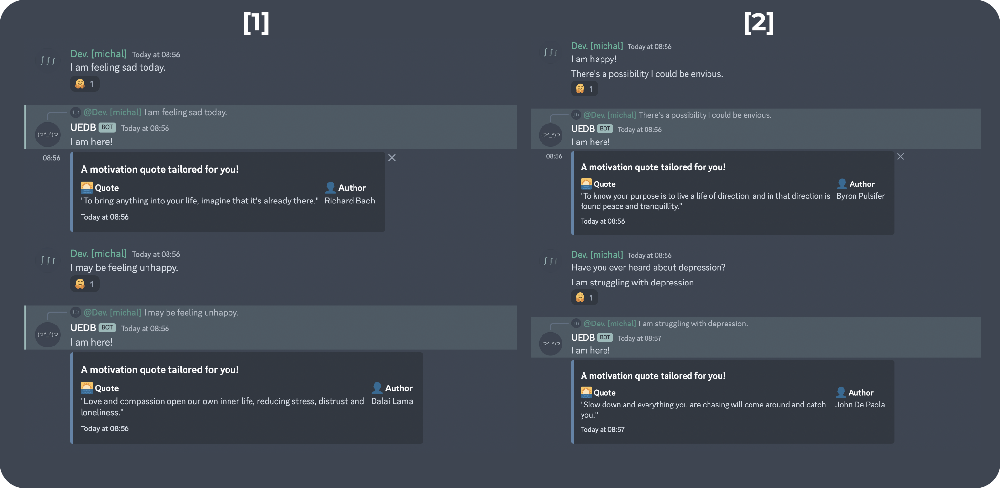

<h2 align="center">The Universal Emotion Detector Bot</h2>


[![Add to your server][discord-shield]][discord-url]
[![Forks][forks-shield]][forks-url]
[![Stargazers][stars-shield]][stars-url]
[![Contributors][contributors-shield]][contributors-url]
[![Issues][issues-shield]][issues-url]
[![MIT License][license-shield]][license-url]
[![Release][release-shield]][release-url]

A `Discord` bot written with `Discord.js` and `Typescript` that scans all messages to detect sadness, fury, and filters all the negative messages by sending a supportive message to their author - it's simple as that.

### But, why?

I've realized that tons of messages in my personal Discord servers (or any others) seemed to be rather __negative__; however, taking care of that myself individually seemed to be, indeed, too much time demanding, and virtually unattainable. So, I've decided to write a bot that would do that for me.

### Synopsis

The bot scans all messages in all channels of all servers it's connected to. If it detects a __negative message__, it sends a __supportive message__ to the author of that message. The bot also sends a message to the channel where the negative message was sent, informing the other users that the message was filtered, and hence raising the awareness of the negative messages to the other users. The _"supportive message"_ delivered contains a response of an `API` call with fetched __quote__ from the database.

### Demo

Here's a __transcript__ of a conversation between the bot and a user:



### Running locally

Following the steps below, you'll be able to run the bot locally on your machine.

```sh
# 1. clone the repository
git clone https://github.com/michalspano/uedb.git

# 2. install dependencies (package.json provided)
npm install

# 3. create a .env file in the root directory
#   and fill it with the following variables:
#   - TOKEN=<your discord bot token>
echo "TOKEN=<your discord bot token>" > .env

# 4. run the bot
npm start
```

### Version log

| Version | Date  | Description |
| :-----: | :---: | :---------: |
| TBD     | TBD   | TBD         |
| TBD     | TBD   | TBD         |

### License

This project is licensed under the MIT License - see the [LICENSE][license-url] file for details.

### Acknowledgments

- [`Discord.js`](https://discord.js.org/#/) - A powerful `node.js` module that allows you to interact with the Discord API very easily.
- `Sentiment.js` - A __sentiment analysis__ tool for `JavaScript`.
- `Typescript` - A __typed superset__ of `JavaScript` that compiles to plain JavaScript.

### Contributing

If you have any ideas on how to improve the bot, feel free to open an issue or a pull request.

<!-- GitHub Shields and links -->
[discord-shield]: https://img.shields.io/badge/Add%20to%20your%20server-7289DA?style=for-the-badge&logo=discord&logoColor=white
[discord-url]: https://discord.com/api/oauth2/authorize?client_id=1086658578598875226&permissions=274877990976&scope=bot
[contributors-shield]: https://img.shields.io/github/contributors/michalspano/uedb.svg?style=for-the-badge
[contributors-url]: https://github.com/michalspano/uedb/graphs/contributors
[forks-shield]: https://img.shields.io/github/forks/michalspano/uedb.svg?style=for-the-badge
[forks-url]: https://github.com/michalspano/uedb/network/members
[stars-shield]: https://img.shields.io/github/stars/michalspano/uedb.svg?style=for-the-badge
[stars-url]: https://github.com/michalspano/uedb/stargazers
[issues-shield]: https://img.shields.io/github/issues/michalspano/uedb.svg?style=for-the-badge
[issues-url]: https://github.com/michalspano/uedb/issues
[license-shield]: https://img.shields.io/github/license/michalspano/uedb.svg?style=for-the-badge
[license-url]: https://github.com/michalspano/uedb/blob/main/LICENSE
[release-shield]: https://img.shields.io/github/tag/michalspano/uedb.svg?style=for-the-badge
[release-url]: https://github.com/michalspano/uedb/tags/latest
